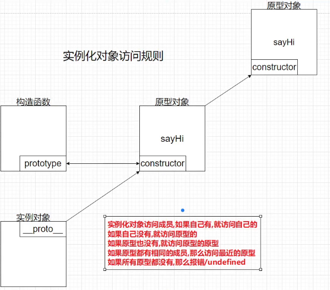

## 运算符

- 按照优先级顺序从上至下划分

```js
---------第一梯队-----
()        // 圆括号
.         // 点语法-成员访问或创建
xxx()     // 函数调用
new()     // 实例运算-    从右至左
a++       // 后置递减
a--       // 后置递增

------- 第二梯队---------------
!          // 取反-       从右至左
~          // 按位非      从右至左
+          // 一元加法    从右至左
-          // 一元减法    从右至左
--a        // 前置递减    从右至左
++a        // 前置递增    从右至左
typeof     // 类型检测    从右至左
void       // 空值        从右至左
delete     // 删除        从右至左
*          // 乘法运算 高于 + 法
/          // 除法
%          // 取余
+          // 普通加法  
-          // 普通减法
<<         // 按位左移
>>         // 按位右移
>>>        // 无符号右移
<          // 小于
<=         // 小于等于
>          // 大于
>=         // 大于等于
in         // 判定
instanceof // 实例检测
==         // 等号
!=         // 非等号
===        // 全等号
!==        // 非全等号

----------第三梯队--------------
&          // 按位与
^          // 按位异或
|          // 按位或

--------第四梯队---------------
&&         // 逻辑与
||         // 逻辑或
?... : ... // 条件运算    从右至左


---------第五梯队--赋值运算    从右至左--------------
=
+=
-=
*=
/=
%=
<<=
>>=
>>>=
&=
^=
|=

----------第六梯队----------------------
yield   // 生成器关键词    从右至左
Spread  //
,       // 逗号运算，永远返回逗号后面的内容包括逗号分割的2函数也是如此
 
let a = (3,5); // 5 逗号运算 永远返回逗号后面的内容 
let a = (2 ?? 3); // 2 空值合并运算，运算左侧为空才返回右侧 作为默认值
let a = (2 || 3); // 2 返回条件为真的一方，若2个值都为真则返回第一个
let a = (2 && 5); // 5 返回假的一方 若2个值都为真 返回后面的值
let b = undefined;
console.log(!!b); // false 双取反返回变量的布尔值
```


## 隐式转换

- 后台进行的一种机制

```js
if(typeof(a) && (-true) + (+undefined) + ''){
    console.log('通过')
}else{
    console.lg('未通过')
}
分析：
1: typeof(a) 未定义= undefined, undefine在typeof内部不会报错，此时得出的是字符串 'undefined'
2: (-true) 隐式转换 true = 1, -1;
3: (+undefuned) 隐式转换，但是undefined不会被+隐式转成Number类型，而是NaN
4:  '', 空字符串 + 一起还是字符型NaN
5： 最终 字符 'undefined' && 'NaN'; 条件成立不为空或false, 因此打印 通过
```


## 词法环境

- JS引擎下：
- Memory Heap 堆内存 用作内存分配，
- Call Stack 调用栈 用作执行JS代码
- Callback Queue 回调队列, 用作存放异步代码
- 注：每个运行的函数，{..} 代码块都有一个内部的变量对象 variable object
  - 记录了局部变量，和对外部词法环境的引用
  - 操作变量相当于操作该词法对象的属性
  - 访问变量时优先搜索当前词法环境


## 预编译

**全局预编译GO (global)**

- JS代码在执行之前需要被引擎进行预编译
- 全局上下文, GO (Global Object) 
- 函数也有,函数执行上下文 (函数定义时系统自动绑定)

```js
showName();  // 编译时: 跳过语句
console.log(myname);  // 编译时: 跳过语句
var myname = 'Hello Vue'; // 声明变量,进行提升 初始值undefined

// 完整的函数声明被提升包括代码块一起
function showName(){
    console.log('函数showName');
}
```

顺序：

1. 创建GO 将全局环境下的变量作为属性，初始值undefined，这一步会跳过语句-
2. 找出函数声明进行提升-包括代码块, 赋值为函数体function，作为GO的对象属性 绑定scope属性 -同时分配堆地址
   1. scope 的0位永远是存储当前函数自身的局部环境 Local, Global 全局上下文对象则会被往后压
   2. 声明以外的代码会编译成字节码--由解释器执行
3. 执行showName()函数 -> 查找GO的变量环境是否有对应字符->foo: 引用->堆空间 Call Stack调用栈(进栈) 

------

**函数的预编译AO/VO  (activation object)**

> 1. 函数执行时创建的AO对象(变量环境Viriable Environment && 包括词法环境) -> 也就是函数执行上下文 (会包括 函数执行时用到的this,，变量，对象以及声明的嵌套函数), 类似作用域
>
> 2. 将形参和函数体内声明的变量作为属性，初始值为undefined ，跳过语句
>
> 3. 查找形参的引用源(即实参)，进行赋值，也就是实参形参统一
>
> 4. 再找出嵌套的函数声明(同样会进行提升和 赋值Function)，接着初始化this与arguments
>
> 5. 正式执行---如果执行完毕且没有其它对象引用，直接出栈-销毁
>
>    1.  未被调用的函数不会执行，只会被预编译/预解析-步骤同上-也会存有GO和AO
>
>    2.  同名的函数会根据声明顺序-覆盖前面的函数
>
>       

注释：

- 函数内部使用arguments对参数length进行修改会产生映射，即值会被修改；任何变量未进行声明而赋值，都为GO全局变量，

```js
// 实参未传 形参也无默认值 = undefined; 
function foo(a,b){
    // 首先会从内部AO查找是否有let/var声明的a变量或函数，在输出语句之前已初始化,没有，undefined ，
    // 注:如果是映射实参未传也是undefined
    console.log(a); // undefined
    c = 0; // var声明成立 c = 0；若为let 则报错
    var c;
    console.log(b,'b函数'); // b函数提升 此处输出b函数
    console.log(c); // 0
    a = 5; // 函数的私有变量,与形参无关，因为形参没有参数值为undefined
    b = 6; // 函数内部声明的私有变量，与变量a一样
    console.log(a); // 5
    console.log(b); // 6
    function b(){} // 函数提升
    function d(){} // 函数提升
    console.log(b); // 6
}
foo();

------------分割线------------
function test(){
  console.log(b); // undefined var声明的b会提升，如果是let则这个函数报错 不允许未初始化提前使用
    if(a){ // 不会执行 因为引用的变量是全局的a,而a为未定义属性值
        var b = 2;
    }
    c = 3; // 自身AO有就用自身的，反之找外层作用域，外层作用域没有就自动创建变量c 为全局变量
    console.log(c); // 3
}
var a;
test();
console.log(a); // undefined
console.log(c); // 3
```


## 函数/变量提升

- 函数会整体提升，调用可以在前/在后，都能执行；注：函数声明会被提升，函数表达式不会被提升-因为它涉及到了赋值操作
- 变量只有声明提升，赋值不提升，提前使用变量会报undefined，let关键字不会提升
- JS声明变量时会执行左侧查找，将值赋予变量，使用值时执行右侧查找即查找引用源
- 注意：如果形参与函数内部的嵌套函数重名，形参无效(即:会被同名函数覆盖)

 ```js
 function test(){
   // 函数内部声明了a 并未声明b,此时b被挂载到了全局windows
   // a在内部使用值为 a = b =1; 即a = 1
      var a = b = 1;
  }
  test();
  console.log(b) // 1; 可以访问b，因为它已经是全局变量了
 ```

```js
 function test(a) {
        console.log(a)// 输出a函数对象
        var a = 1;
        console.log(a); // 1
        function a() { }; // 函数提升
        console.log(a); // 1
        // 匿名函数被作为返回值赋予变量B即为函数表达式，不会产生函数提升
        var b = function () { }; 
        console.log(b); // b函数
    }
    test(2)
1: 预编译: var a = undefined; var b = undefined;
2: 预编译: function a(){}; 提升到顶部
3: a = 1; b = Function 函数赋值操作(不产生提升)
4: 输出a = a函数; 输出a = 1; a = 1; 输出b函数
```


```js
 let x = 1,
 y = z = 0;
 function add(n) { // 会被覆盖 即不存在
     return n = n + 1;
 }

y = add(x);//调用add传入x; y = 1 + 1
        
 function add(n) { // 函数提升 同名覆盖
     return n = n + 3; //4
 }
 z = add(x);// 调用add传入x;z = 1 + 3

console.log(x, y, z) // 1 4 4
// 预编译 GO = {
//         x:1,
//         y:0,
//         z:0,
//         add:function add(n){return n = n + 1},
//             function add(n){return n = n + 3}, // 覆盖了上方函数
//    }
```


## 执行上下文

- 上下文分为：全局上下文、函数上下文、块级上下文
- 代码执行流每进入一个新上下文，都会创建一个作用域链，用于搜索变量和函数
- 函数或块的局部上下文不仅可以访问自己作用域内的变量，而且也可以访问上一级的上下文和全局上下文->中的变量属性
- 而全局上下文只能访问全局上下文的变量和函数体
- 变量的执行上下文用于确定什么时候释放内存/出栈
- 离开作用域的值会被自动标记为可回收，然后在垃圾回收期间被删除


## 作用域

作用域链是一种查找机制-负责收集并维护由所有声明的变量 组成的一系列查询，确定当前执行的代码对这些变量的访问权限  (归属于词法作用域)

- 函数在声明时，系统会创建一个变量对象的scope作用域属性(对象)，用于保存函数自身属性和对GO的引用
- 这个作用域顶端0位一开始只存储了GO全局执行上下文、它存有全局声明的变量和当前函数体，

 ```js
function bar(){
    // 输出 极客时间,与函数是否在另一个函数的调用位置无关,因为bar与foo函数的上级都是全局GO，
    console.log(myName); 
}
function foo(){
    var myName = '极客';
    bar(); // bar函数调用依然使用全局myName'极客时间',它们之间并不属于函数嵌套关系
}
var myName = '极客时间';
foo();
// 在这里GO一开始只管全局声明的myName加函数bar和foo
// 内部函数访问外层作用域的变量也可以对其进行修改，前提是自身作用域没有同名变量

------分割线--修改函数-----
function bar(name){
  console.log(name); // 输出'极客' ，函数调用时实参优先于全局变量
}
function foo(){
    var myName = '极客';
    bar(myName); // 将foo函数内部的myName作为参数传递
}
var name = '极客时间';
foo();

----------------------
// 下列函数涉及了三个上下文；执行函数上下文时都有一个内部的变量对象
// 全局上下文：有一个变量color 和一个函数体 changeColor
// changeColor函数上下文: 有一个变量anotherColor 和一个函数体swapColors及它的调用
// swapClolrs函数上下文: 有一个变量tempColor和对上一级上下文的引用 anotherColor 和对全局上下文的引用 color

var color = 'blue'

function changeColor () {
  let anotherColor = 'red'
  
  function swapColors () {
    let tempColor = anotherColor // red
    anotherColor = color // blue
    color = tempColor // red
    // 这里可以访问 color、anotherColor 和 tempColor
	console.log(tempColor,'red');
	console.log(anotherColor,'blue');
	console.log(color,'red');
  }
  // 这里可以访问 color 和 anotherColor，但访问不到 tempColor
  console.log(color,'blue');
  console.log(anotherColor,'red');
    
  swapColors()
}
// 这里只能访问 color
changeColor()
 ```

- 

- 然后函数在执行时，会创建自己的AO (函数)执行上下文并存储到作用域0位, 用来保存自身作用域内的变量对象和函数体，同时GO全局执行上下文被移动到作用域的第1位也就是栈底(每次都会保存上一级函数的引用)，所谓作用域就是从自身AO上下文环境的栈顶开始查找- 直至栈底的GO，全局上下文GO永远是作用域链最后一个

  **总结**：

- 函数定义时只会绑定GO，执行时才会创建AO，当外层函数执行时会导致内层函数被定义，同样会产生以上步骤。因此查找永远是优先从自身AO的0位开始，或者说作用域链就是一种排列方式

- 这里需要注意的是let关键字声明的变量会单独存入执行上下文的词法环境(一个小型的栈环境)不会与外层作用域的变量产生同名冲突，也称作屏蔽效应


如下图：

```js
function a(){
    function b(){
        function c(){       
        }
        c()
    }
    b()
};
a()
---------
// a 定义时: a.[[scope]] -> 0: GO
// a 执行时: a.[[scope]] -> 0: a -> AO
//                          1: GO
    
// b 定义时：b.[[scope]] -> 0: a -> AO
//                         1: GO
// b 执行时: b.[[scope]] -> 0: b -> AO
//                         1: a -> AO
//                         2: GO
    
// c 定义时：b.[[scope]] -> 0: b -> AO
//                         1: a -> AO
//                         2: GO
// c 执行时: b.[[scope]] -> 0: c -> AO
//                         1: b -> AO
//                         2: a -> AO
//                         3: GO
--------------------
// 然后c执行完毕后会回到被定义时的状态，再接着b也会回到被定义时状态-此时c就会被销毁
// 接着a会回到被定义时的状态-此时b也会被销毁
// 最后就意味着整体执行完毕a 也会被销毁
```

```js
 function Start(name){
      proto:{
         this.name = name;
      }
 }
 let btn = new Start('xjj')
 console.log(btn.name);
 console.log(btn.__proto__);
// 结合下图一开始 0为存储全局对象 函数执行时生成自身对象集占据0位 全局对象往下挪到1
```


### 详解

```js
var a = 100;
function foo(){
    console.log(a); // undefined
    // 此处虽然return了，但是在函数创建上下文时自身的a依旧被添加到了AO, let声明的变量则情况不同
    return;
    var a = 200;
}
foo();
-------分割线---词法作用域----
let count = 1;
function main(){
    let count = 2;
    function bar(){
        let count = 3;
        function foo(){
            let count = 4;
        }
    }
}
// 词法作用域由代码位置来决定，兄弟函数的上级都是父作用域，也就是互相调用依然是从自身到父作用域查找
1: 全局GO：全局count变量 && main函数 ->
2: main函数: 私有count变量 && bar()函数 ->
3: bar函数:  私有count变量 && foo函数

-------分割线---词法作用域----
a = 1;
function foo(e){
    function e(){}; // 同名覆盖形参
    arguments[0] = 2; // 实参更新 又覆盖了e函数
    console.log(e); // 2
    if(a){ // a未声明定义 = undefuned 不会走这里条件
        var b = 3; 
    }
    var c;
    a = 4;
    var a;
    console.log(b); // undefined 上面的if语句不成立
    f = 5;  // 全局泄露
    console.log(c); // undefined 
    console.log(a); // 4
}
var a;
test(1);
console.log(a); // 全局变量a = 1
console.log(f); // 全局泄露的变量f = 5, 必须是函数执行后才会泄露，函数不执行不泄露
```


## 闭包

注释：在JS里 所有函数天生都是闭包的, 这是一种机制, 可以记录引用和保护私有属性，与词法环境有关

- 函数执行时会形成的一个私有的执行上下文，如果上下文中的某些内容被上下文之外的函数对象引用，就会导致其在内存中不能被释放，就形成了闭包，
  - 包括函数被作为另外一个函数的参数，或者作为另外一个函数的返回值，
- 因为相互引用的关系，函数作用域未被释放，因此函数的生命周期也被提升了。
- 相应的函数在执行完毕后没有被销毁而是回到函数定义时的状态，一直到最后的引用函数执行完毕才最终被销毁
  - 在函数scope作用域属性中可以查看到闭包详情Closure
- 函数无论它是在那里被调用的，它都会关联它被创建时的上下文，除非更改它的this指向

```js
 function test1() {
       function test2() {
           var b = 2;
           a = 5; // 引用外层的变量a进行修改，如果外层没有就会自动创建全局变量a
           console.log(a) // a输出5 证明了test1未被销毁
       }
       var a = 1;
       return test2; // return 一个闭包
   }
   var c = 3;
  // 执行test1 返回return test2, 可以进行赋值操作进行接收
   var test3 = test1();
   test3() // test只是引用了test的返回值test2
------------
// test1 定义时引入了GO 执行时创建了AO 接着test2被定义引用了GO，
// 当test2被抛出去给test1, test1执行完毕回到被定义时状态，但是不会被销毁
// 因为test2 还未执行 它引用了test1的AO上下文 即里面有变量a, 闭包形成
// 接着test3这个变量接收了test1执行时抛出的test2，可以称test3是一个函数表达式
// 执行test3的时候实际就是在执行test3 = test1 = test2,他们是相互引用的关系
// 直到test3执行完毕 整个函数才会被销毁
-----分割线---
function depClone() {
   let girl = {
       name: '石原里美',
       age: 18,
       works: '非自然死亡',
       cooking: function () {
           console.log('猪脚饭');
       }
   } // 利用闭包 引用girl 并返给spa函数
   function spa() {
       return girl;
   }
   // 再将spa函数返回给depClone函数
   return spa;
 }
//  此处只new 了一次depClone创建了一个实例，并未造成内存浪费
//  后续的所有实例都将共享这个实例对象的引用地址
let clous = new depClone();

let banban = clous();
let heihei = clous()
console.log(heihei === banban); // true
banban.cooking(); // 猪脚饭
```

例子：下面例子如果正常循环每次拿到的i是循环后的全局变量i===3,利用闭包可以拿到正确值，将var改let 也可以实现

```js
<div>
<button>我是第一个按钮</button>
<button>我是第二个按钮</button>
<button>我是第三个按钮</button>
</div>
let btns = document.querySelectorAll('button');
for(var i = 0; i < btns.length; i++){
    // 利用闭包实现点击打印索引
    (function(i){ // 每次点击按钮后函数执行都会创建一个私有上下文保存内部变量，即i被保存进了当前作用域
        btns[i].onclick = function(){
            console.log('${i}')
        }
    })(i);
}
```


```js
function foo(){
    var myName = '极客时间';
    let test1 = 1;
    const test2 = 2;
    
    var innerBar = {
        getName: function(){
            // 根据作用域规则 test1为引用外层作用域声明的test1 
            console.log(test1); // 1
            return myName; // 返回'极客时间' ，但是已被setName函数内部进行了修改，因此返回 极客邦
        },
        setName: function(newName){
            myName = newName; // 对父级作用域的myName进行了修改
            console.log(myName); // '极客邦'
        }
    }
    return innerBar;
}
// foo函数执行结束不会被销毁-因为return的innerBar函数依旧在访问其中的变量，
// 也可以说innerBar函数是foo函数的闭包
var bar = foo(); 
bar.setName('极客邦');
bar.getName(); // 1
```


## 函数详解

注释：函数也是一种对象类型，是Function的实例，函数名只是一个指针(指向函数对象)

1. 具名函数：在定义时就创建函数对象和作用域对象，即使未调用也占用空间
2. 匿名函数：调用时才会创建函数对象和作用域对象； 适合做为：回调函数(即将函数作为另一个函数的参数)，
3. 函数内部会隐式return结束函数，如果要返回结果则显式return xxx;即可
4. 函数就是一段固定的功能模块-去执行某个指定的事情，而return则是函数的出口
5. 无论函数是如何创建的，它都是一个值，或者说它最终会返回一个结果值，所以函数可以作为值被分配，被复制和声明
6. 函数如果作为表达式的一部分被创建，称为函数表达式，优先级低于函数声明式，内部算法会优先处理函数声明，因此预编译阶段函数表达式不会被提升，函数声明则会被提升
7. 函数表达式只有在执行流程到达时才会被创建，而函数声明在定义时就会被创建在内存中
8. 当一个函数被调用时，会创建一个活动记录对象（也称为执行上下文）。这个记录对象会包含函数在哪里被调用（调用栈）、函数的调用方法、传入的参数等信息，this就是其中之一

```js
// 匿名函数本质也是一个函数表达式 强行起名会被忽略 所以起名只是为了易读性
function fn(num){}
fn(function(){
  // 将匿名函数作为参数 这个作为参数的函数就是回调函数
})

----分割线-----
(function(){
  // 这是一个匿名函数 也属于函数表达式
} 

----分割线-----
var a = 10;
if(function b(){}){
  // 执行了函数名b() 报错因为匿名函数加函数名无效
  a += typeof(b) 
}，
console.log(a) // 10 undefined
// if()内部的是函数表达式 为true 同时会忽略函数名b，
// 内部执行b是不存在的 会报错，但是加了检测符就会输出 undefined

-----分割线-----
let Studay = function(){} // 函数表达式
```


```js
---匿名函数的妙用---
// 衔接上面，将要运行的函数放在第二位 当作参数传入第一个函数
// 同时在第一个函数内部调用它并将window全局变量a当作参数传递给def
// 这样就实现了函数的运行顺序颠倒
    
// 本质上其实还是先运行的第一个函数只不过它里面传进了第二个函数作为参数又在函数顶部进行了调用所以先运行了第二个函数，如果将其放在第一个匿名函数的作用域底部调用其实还是正常顺序执行
var a = 2;
 (function IIFE(def) {
     def(window)
 })(function def(value) {
     // 这个value就是形参--实参为传递过来的window
     var a = 3;
     console.log(a);
     // 所以value.a 就是全局的 window对象下的 var a = 2;
     console.log(value.a);
 })
```


## 函数名

```js
function sum(a,b) {
    return a + b;
}

console.log(sum(10, 10)); // 20

// 不带括号的函数名sum访问的是函数名(指针)，将其赋值给sum2,此时sum和sum2都指向了同一个函数对象
let sum2 = sum;
console.log(sum2(10 ,10)); // 20

sum = null; // 切断函数名sum与其指向的函数对象的关联
// 而这里sum2依旧可以正常执行，说明之前赋值的时候是赋值的指针指向，它们指向的是同一个函数
console.log(sum2(10,10)); // 20
```


## 动态函数

- 动态函数指根据条件决定函数功能的一种方式，采用函数表达式更合适

```js
let age = 17;
let test;

if(age < 18) {
    test = function() {
        console.log('小于18')
    }
} else {
    test = function() {
        console.log('大于18')
    }
}

test(); // 小于18
```


## 立即执行函数

- 只有匿名函数才能自执行();  立即执行函数可以模拟实现块作用域
- 立即执行函数有返回值，可以进行赋值操作， 
  - 立即执行函数也属于函数表达式，因为只要加了括号()/{}都属于表达式，只要是表达式它都会有一个返回结果
  - 而函数声明后面不能加括号会报错，但是括号内部加参数不会报错，但不会执行
- 函数立即执行，执行完毕自动销毁
- 立即指向函数也可以不立即执行，先不要写括号，在外部调用立即执行函数的引用(变量),对齐进行调用

```js
let a = 1;
let b = 2;
let sum =  (function (x, y) { // 作为表达式赋值给sum
//如果想将结果抛出去就return
  return x + y
})(a,b); // 立即执行并传参
console.log(sum); // 3

----分割线-----
(function(){
  // 这是一个匿名函数 也属于函数表达式
}(这里可以传参)) // 可以立即执行

-----让一个函数声明变成函数表达式------
1 && function foo(){
    console.log(1)
}(); // 变成函数表达式后就能是由括号立即执行了，函数名会被忽略

----分割线-----
 // 三个函数同时存在 会执行第二个 第三个报错
 // 原理:第二个函数是函数声明加括号执行会报错但是加参数为表达式-不报错不执行
 // 为什么会执行第二个? 原因在于第一第二个函数重名，后面覆盖前面,且全局环境下有foo()调用
 function foo(x){
    console.log(arguments,'1');
    return x;
}
foo(1,2,3,4,5)

function foo(x){
    console.log(arguments,'2');
    return x;
}(1,2,3,4,5)

(function foo(x){
    console.log(arguments,'3');
    return x;
})(1,2,3,4,5)
```


## 函数对象和返回值

- 函数对象用于多人开发，避免了作用域混乱，
- 它可以作为参数或返回值
- 返回多个函数可以使用
  - []数组形式 ，通过实例[0] (可传参数) 调用
  - 也可以使用对象形式返回，即一个对象下面挂载多个赋值函数，通过点语法访问

```js
let obj = {
    say:function(){
        console.log('xjj')
    }
}
obj.say()

------------分割线----------
function foo(){
    console.log('外层函数foo')
    return function to(){
        console.log('里层函数to');
        return function go(){
            console.log('第三层')
        }
    }
}
let num1 = foo(); // foo函数在执行的同时，会返回里层to函数，可以使用变量进行接受
let num2 = num2(); // 而执行里面函数to的同时 to也会返回go函数
num2(); // 执行go函数
```


## 私有变量

- 私有变量包括函数参数、局部变量，以及函数内部定义的其他函数

```js
function add(num1, num2) {
    let sum = num1 + num2;
    return sum;
}
// 函数add 有3个私有变量 num1,num2,sum;这3个变量只能再函数内部使用，
// 除非使用闭包 闭包可以通过作用域链去访问到外部变量，也可以将其传递至另一个函数中去
// 模块模式也可以实现这一点，就是模块自执行时将需要返回的东西return 出去
```


## 函数参数问题

参照私有变量

- 函数创建AO时初始化形参作为内部属性(局部变量)，调用时传入实参进行赋值，存在映射关系
- 如果实参未传则为undefined , 实参值 优先级 高于 形参默认值，前提是实参不为空或undefined
- 函数内部可修改实参，但是如果实参未传，那么函数内部声明的同名变量就为函数自身私有变量,与实参无关,
  -  注意： 简单数据类型是直接复制副本给了形参(所以实际修改的是函数自身的局部变量而不是实参），而复杂数据类型是复制了堆引用地址给了形参，函数内部对其进行修改，会影响到所有使用该堆引用地址的变量，两者是有区别的
  - 函数内部用let声明的与形参同名的变量会报错，因为都是函数的局部变量, 不允许重复，而var则是可重复声明的 不报错

```js
// 函数的形参就是函数内部的私有变量，实参就是调用函数时对其进行赋值，也称形参实参相统一,或者说形参引用了实参
// 函数内部可以修改实参，前提是函数没有定义局部的同名变量(形参也是函数的局部变量)
function fn(a,b){
    console.log(fn.length); // 1 可以检测函数形参个数
    console.log(arguments); // 可以检测实参个数
    return a + b;
}
fn(1,2)

---------分割线---------
function fn(a,b){
    // 函数内部可以修改实参值，但是如果实参未传，那么内部声明的变量就属于函数私有变量存在栈内存
    // arguments属于实参列表-存储在堆内存，但是其存在映射关系，也就是实参存在，函数内部就能映射-可以修改
    // 如果对应实参不存在，那么函数内部的变量即使同名也是属于函数私有变量
    b = 3;
   console.log(b); // 3
   console.log(arguments[1]); // undefined 未传入参数
}
fn(1)

---------分割线---------
// 函数参数的优先级-也有映射关系
function fn(a = 1, b){
   // 2  如果形参有默认值，那么在实参也存在的情况下，实参会对默认值进行覆盖
   // 但是由于映射关系，实参也好形参也好不能为undefined未定义的值，否则以有实际值的一方为准
   console.log(a); // 2
}
fn(2,3)

---------分割线---------
 let x = [12,23];
function fn(y){
 // 执行首先查找自身是否有y-没有-找作用域(上级)-有个全局y数组(引用类型),函数内部以数组形式访问才行
    y[0] = 150;
    y[1] = 100;
//  到此处又有个y-查找自身-没有-全局也没有-于是自动创建自身私有变量-对其进行赋值200
    y = 200;
    console.log(y); // 200
}
fn(x);

console.log(x);   // 150 200

---------分割线---------
 var a = 1;
function test(a){ // 如果吧形参去掉则下面的a就会找到上下文中的全局a=1
    a = 3; // 此处是函数自身私有变量a 相对于var a = 3; 与全局a无关
    console.log(a); // 3
}
test(a); 
console.log(a); // 1

---------分割线---------
 var a = 1;
function test(a){ 
    let a = 3; // 报错 函数私有变量a 不允许重复声明，它已经被赋值(全局a的副本)
    console.log(a);
}
test(); 
console.log(a); // 1
```


总结：(function()){}, let sum = function(){}，此类都是匿名函数表达式


## 构造函数new

注释：自定义构造函数-用于插件和原型开发- 函数名首字母大写用于区别于普通函数

- 构造函数 new做了那些事情

-  new关键字 在函数内部隐式的创建了一个空对象，绑定了this的指向，执行构造函数内的代码，给这个对象添加属性和方法，并在最后返回填充了值的this，直白点说就是为new创建的新对象进行初始化


- this.xxx 实际就是在向new创建的实例对象上添加属性和方法  ，每一个实例都是独立的副本
- 注意点：构造函数内部声明的变量属于构造函数本身，不属于构造函数实例化后创建的对象
- 通过this添加的成员属于实例成员，是由new实例对象构造的，实例成员只能通过实例对象去访问。
- 通过构造函数内部声明的成员属性，则属于构造函数本身的静态成员，,只能函数内部使用-但可以通过原型被实例引用，也可以当作参数传递出去

注：函数默认return的是undefined,实例化后才是返回被填充了值的this对象， 即构造函数不需要手动return

```js
function fn1(bar,ban){
// 每个函数与实例对象都有constructor 其指回构造函数本身(用于追踪源构造函数) 内部有隐式arguments
// new以后函数开始执行，创建AO:里面保存了this对象,
// AO = {
//  this:{
//   bar:bar
//   ban:ban
}
}

// 这里me等同于隐式的this
   var me = {};
    me.bar = bar
    me.ban = ban;

// 最后rutrn 出去时相当于抛给了全局GO
// GO = {
//   fn1:(function),
//   car:{
//   bar:'bar'
//   ban:'Mazda'
}
}
// 类似 return this 保存到了全局GO
// 这里return 只认me和引用值，return原始值无效
    return me;
}
// 等同于new fn1(),new关键词在构造函数内部创建了一个对象this:{}
// 并将它指向实例化创建的对象

// var car = new fn1('red','Mazda')
var car = fn1('red','Mazda');
console.log(car.bar);
console.log(car.ban);
```

```js
// 图解
function depClone(name, age) {
    this.name = name,
       depClone.prototype.name = name, // 等同于上面的this
       console.log(this.name === depClone.prototype.name);// true
      // this.age = 19,
    // 构造函数不需要return 写不写都无所谓
    return this;
 }
let blo = new depClone('李总', 22)

---分割线-----------------------
    function Teach(name){
        let c = 20;
        this.name = name;
        this.age = 20;
        this.say = function(){
            --c;
            console.log(c,'实例成员引用构造函数静态成员c',name); // xjj / ldh
            foo(c); // 当作参数传递给外部的foo函数引用
        }
    }
function foo(add){
    console.log(add,'引用于构造函数的静态成员')
}
let a = new Teach('xjj');
a.say(); // 19 实例成员引用构造函数静态成员c xjj
let b = new Teach('ldh');
b.say(); //  19 实例成员引用构造函数静态成员c ldh
console.log(a.prototype === b.prototype); // true
```


### new.target

- 用于检测函数是否是被new 关键字调用的, 是返回整个引用函数的源代码，不是返回undefined

```js
function Fn(name) {
    if(new.target) {
        cosole.log('是被new调用的')
    }
    this.name = name
}

let a = new Fn('xjj')
```


## 函数的属性和方法

- 函数都有length 和 prototype
- length属性，用于列出函数的命名参数(形参)个数，与内部的arguments列出实参个数类似
- 还有name属性，显示函数名，如果函数是一个表达式，则接收表达式的变量名被推断为函数名

```js
// 这个foo没有必要，但是可以作为函数名，如果不写就推断num为这个匿名函数的函数名
let num = function foo(name,age) {
    // num函数的实参 arguments.length = 1
    console.log(arguments.length)
}

num('xjj');
console.log(num.length); // 函数num的形参length = 2
```


## arguments类数组

- arguments: 实参列表-类数组，只存在于函数内部可用
- Symbol 符号：可迭代对象标志
- arguments会使得函数不可优化，不建议使用
- 缺点：如果形参列表有默认值，或者通过arguments[]修改参数值后，arguments将不会跟踪实参
- arguments有一个属性叫 callee 召唤，它引用的是当前函数，该属性可以使得函数名与函数解耦，在不知道函数名的使用比较方便，比如应用到递归，但这个属性在ES5被废弃了。但是依然可以保留使用

```js
// 函数参数的对应关系: 必须一一对应
// 函数参数的映射关系: 是对内存位的一种映射
function test(a){
    argumnets[0] = 10;
    console.log(a, arguments[0]); // 打印出来的都是10
}
test(2)

--------分割线--------
// 给类数组设置成数组特性，添加方法
var obj = {
    '0': 'xjj',
    '1': 'ldh',
    '2': 'zxy',
    '3': 'ggg',
    'length': 4,
    'push': Array.prototype.push
}
obj.push('Good')
console.log(obj);
console.log(obj.length);

-------------
 // arguments.callee解耦函数名
 function dep(n) {
  n === 1 ? 1 : n
    // 这样可以不用关注函数名 调用callee就可以进行递归或匿名定时器取消
    return n * arguments.callee(n - 1)
}
dep(5)
```


### 类数组注解

- 数组是特殊的对象，是对象的一种表达方式
- 类数组有部分数组功能，但无法调用数组大部分方法
- 如果需要，可以给对象或者类数组收到添加功能

```js
// 这个类数组形式的对象它没有数组功能，但是手动添加后 它就可以调用相应方法
let obj = {
    // 对象的键会自动转为字符类型，加不加都一样
    0:1,
    1:2,
    2:3,
    length:3,
    // 给它添加push方法
    push: Array.prototype.push
}
```


## 包装类

注释：原始值没有方法属性也不能通过.语法设置访问，但是如果我们这么做了：比如

- var a = 1; a.length = 3; 系统会调用new Number()/new String()方法将其转换成复杂类型数据-即对象，并创建临时变量接收它，然后将临时变量赋值给a，


- 最后销毁临时变量，如果手动显式的进行包装类则要使用变量接收，否则得到的就是undefined

不同类型上的toString方法是不一样的，

- Number.prototype.toString.call(1);得到的是 “1”

- Object.prototype.toString.call(1);得到的是类型 object Number

```js
var a = 1;
// a.len = 3;
// console.log(b) // undefined
let b = a.len = 3;
console.log(b) // 3
------字符串/数组截断
 let str = 'abc';
 let sum = str.length = 1;
// 必须使用变量接收，否则经过包装类后 同样会被系统删除
```

```js
let name = 'liudehua';
name += 10; // 'liudehua10'

let type = typeof(name) // string / 长度为6
// 进行包装类 使用type变量接收 否则type.text得到的就是undefined
let type = new String(typeof(name))
      
console.log(type); // string{'string'}

if(type.length === 6){ // true
   type.text = 'string'; // 隐式类包装
}
console.log(type.text)
```


## 原型

注释： 原型  它就是一个提供公共属性方法的对象，所有函数在定义的时候都会原型对象

​     上-供多个实例使用，**无法通过增删改去变更继承过来的原型属性和方法**，

- 函数/构造函数声明时会创建一个原型prototype(挂载系统内置的属性方法)，可以被所有实例对象共享
- 同时原型对象被创建时会自动生成 constructor 构造器 指向与之关联的构造函数本身,它就是一个记录指针，(指向可以被更改) ，重点：它保存的是实例化之前的内容，同时它也可以被手动添加
- proto是实例化后的结果,拥有构造函数的prototype,也就是说原型proto属于实例化对象，而不是属于构造函数, 
- proto相当于一个键名 作为容器：存储或者说作为委托入口，引用了构造函数的prototype，
- 优先使用自身属性方法,当自身没有时会通过proto入口-> 去构造函数的原型ptototype上查找

1. 总结：函数拥有：原型对象prototype, 实例对象拥有：对象原型proto。proto指向构造函数的原型对象prototype(可以理解成引用/被赋值)
   1. 原型对象同样也有自己的__proto_指向-> Object.prototype，也有自己的 constructor指向关联的构造函数
   2. 最后顶端的 Object.prototype 的原型 为 null
   3. 简介说就是原型对象也是另一个类型的实例，另一个类型也有入口指向另一个构造函数,它就是Object
2. 不同的实例使用同一个构造函数内的动态属性，开辟的是不同的内存空间(副本)，互不干扰，只有原型上的属性方法是共享的
3. Fn.prototype.isPrototypeOf();  可以测试一个构造函数的原型对象->是否存在于实例对象的原型链上，true表示存在 实例对象的proto引用了构造函数的原型对象。false则反之

 ```js
function Proent(name){
    this.name = name; // 指向window 一旦实例化后则指向实例化对象
    // Proent.prototype.name = name; 实际就是this.name = name; 都是在为当前构造函数添加成员属性
    // 与在外部通过Proent.原型添加say方法相同，证明实例对象的__proto___指向构造函数的原型prototype
    var this = {
        __proto__:{
         Proent.prototype.say = function(){
            console.log(this.name, '我是原型')
        }
      }
    }
}

let ldh = new Proent('xjj');
let zxy = new Proent('测试')
console.log(ldh.name); // xjj
ldh.say(); // xjj 我是原型(自身没有say方法 找到原型-> 有)
console.log(ldh.__proto__ === Proent.prototype); // true
console.log(ldh.constructor === zxy.constructor); // trure 证明两个实例对象引用了同一个构造函数Proent

// 表示Proent的原型对象存在 ldh这个实例对象的原型上，说明ldh引用了Proent的原型对象
Proent.prototype.isPrototypeOf(ldh); // true 
// 原型对象的原型__proto__指向Object.prototype->Object.__proto__ 指向 null
console.log(Fn.prototype.__proto__.__proto__ === null); // true
console.log(Fn.prototype.__proto__ === Object.prototype && Object.prototype.__proto__ === null); // true
 ```


 

​    

## 原型的访问方式

注释：es6不建议使用proto访问实例原型，替代方案为 Object.getPrototypeOf()

- 原型prototype是Functiond对象的一个属性，也属于对象，只要是对象都可以通过点语法访问或添加方法
- 手动设置构造函数的原型 = {对象} 会有一个副作用，抹掉了constructor, 可以在对象内手动添加constructor:构造函数

```js
 function Foo() {
     console.log(this);
     this.bb = 'hello';
     this.a = 4;
 }
 Foo.prototype = {
     aa: 5,
     bb: 6,
 // 原型更改后就没有constructor 需要手动添加并指回它的构造函数
     constructor:Foo
 }

let foo = new Foo();
console.log(foo.aa); // 5
   
console.log(foo.__proto__); // {aa:5, bb:6}
console.log(Object.getPrototypeOf(foo));// {aa:5, bb:6}
```


## 原型链

1. 构造函数声明时都会有一个原型对象 petotype,原型内部也会生成构造器constructor 用来指回构造函数本身，

2. new实例化对象的时候会在函数内部创建一个空对象并绑定this指向，同时产生对象原型proto：

   proto是属于实例对象的，作为容器或者说是委托入口链接构造函数的原型对象prtotype,

3. 当我们访问某个属性或方法时如果本身没有就会通过委托入口proto__往上去查找，如果没有找到，再继续通过原型对象prototype的proto_继续查找，直到最顶端的Object.prototype

4. 所以可以把动态设置的属性写在构造函数内部，将公用的方法挂载到原型上，让多个实例共享

5. 另外实例化的原型对象proto指向是可以被更改的，也就是继承，call,applay,bind

- 所以什么是原型链：
- 可以这么说: 实例对象的原型proto连接构造函数的原型对象 prototype,原型对象prototype也是一个对象，它也是另一个构造函数的实例，也有自己的原型proto, 指向Object.prototype，JS运行时属性是从自身开始查找的，没有对应属性的话就沿着这根链条继续查找，直到 Object.prototype停止

```js
function Dog(name) {
  this.name = name;
}

let beagle = new Dog("Snoopy");

// 实例对象beagle是否存在于Dog构造函数的原型对象上
Dog.prototype.isPrototypeOf(beagle);  // true

// Object是所有对象的父类，构造出来的对象以及实例对象都会存在于其原型链上

// Dog构造函数的原型对象是否存在于Object.prototype上
Object.prototype.isPrototypeOf(Dog.prototype); // true
// 实例对象beagle是否存在于Object.prototype上
Object.prototype.isPrototypeOf(Object.getPrototypeOf(beagle)); // true
```


## 继承

- 就是借用另一个构造函数的属性方法，让实例实现更大范围的共享


## 寄生组合继承

注释：目前最优继承 优于单独call和组合继承

- instanceof ：判断一个对象实例是否来自于指定对象的原型上，也就是是否为继承关系(包括内置对象)
- Object.prototype.isPrototypeOf ：可以判断一个原型对象是存在另一个对象原型上(constructor有记录指向)
- 不要去更改公共原型上的属性，为了不更改公共原型的属性，可以使用一个空的中间构造函数作为缓冲层，这样后面的构造函数实例更改东西就不会影响到公共原型，原因就在于相互间不再是同级关系
- 实例化的原型对象proto指向是可以被更改的，也就是继承，call,applay,bind

```js
// 寄生组合继承 

// 构造函数-也称工厂模式
function Fanter(name,age,val){
    this.name = name;
    this.age = age;
    this.val = val;
}
// 添加原型方法monery用作共享-也称构造函数的动态方法
Fanter.prototype.monery = function(){
    console.log(this.name,'Fanter构造函数name');
    console.log(this.age,'Fanter构造函数age');
    console.log(this.val,'Fanter构造函数val');
}

let fanter = new Fanter('xjj',18,'Fanter的val');
console.log(fanter.name,fanter.age,fanter.val);
fanter.monery();

console.log('--------分割线-----------');

function Son(name,age,val1){
    this.val1 = val1; 
    // val1没有更改this 属于Son构造函数自身私有属性,也可通过实例对象进行访问
    // 当Son指向Fanter并传入name的时候表示借用了父类Fanter的this.name=name，这里this === Son
    Fanter.call(this,name,age);
}

// 创建一个新对象 将工厂函数Fanter作为新对象的原型prototype, 同时配置constructor
// 新对象接收2个参数，一个为新对象提供__proto__的父对象, 一个为新对象添加属性值和属性描述的对象
Son.prototype = Object.create(Fanter.prototype,{
   // 配置属性是为了让Son的constructor正确指向Son,并添加上属性(不包括原型上的属性)和属性描述
   constructor:{
       value:Son,
       enumerable:false,
       configurable:true,
       writable:true
   }
  // 这样工厂函数作为新对象的原型入口, 子函数的静态成员作为新对象的属性成员
  // 再赋值给子函数 只需要使用call更改this即可实现继承属性和原型，又不破坏函数的原型结构
})

// 继承来的原型方法也可以重写 比如Fanter有个方法monery那么Son.prototype.monery = xxx 可以对其进行重写,并不会破坏它的原型结构

Son.prototype.monery = function(){
    console.log(this.name, 'Son原型方法')
}

let son = new Son('ldh',17,'Son的val');
console.log(son.name,son.age,son.val1);
son.monery(); //  重写继承的原型方法，不会影响父类的实例
fanter.monery(); // 事实证明没有受到影响

console.log(son.prototype === fanter.prototype); // true，两者引用自同一构造函数的原型
console.log(son instanceof Fanter); // true, 证明son 继承自 Fanter
console.log(Object.getPrototypeOf(son)); // 查看原型
Fanter.prototype.isPrototypeOf(son); // Fanter的原型存在son的原型上(constructor有指向)
```

- 下图证实了寄生组合继承的优势，在继承父类构造原型方法的同时又不破坏自身原型链
- 


## 原型继承

- 缺点: 父类的原型会覆盖子类本身的原型属性,且存在引用值共享问题

```js
// 原型继承  
Professor.prototype.tSkill = 'java';

function Professor() { };
var professor = new Professor();
console.log(professor)

// 继承了Professor的原型拥有java
// 如果是 = professor.prototype则表示只继承 Professor的原型而不继承它构造函数内 部的属性
 Teacher.prototype = professor;
 function Teacher() {
     this.mSkill = 'js/jQ';
     this.students = 500;
 }
 var teacher = new Teacher()
 console.log(teacher)

// 继承了Teacher的原型拥有js/jQ和500
 Student.prototype = teacher; 
 function Student() {
     this.pSkill = 'HTML';
 }
professor.tSkill = '修改了'；// 如果这里修改了父类 会影响所有引用其原型对象的子类
 var student = new Student();
// 本身拥有HTML并继承了students得到501(原型上面依旧是500不可改)
 student.students++; // 本身没有会从继承原型上找
 console.log(student)
```


## 混入Mixin

- 继承并不适用于所有情况，有时候两个不相关的对象需要使用共同的方法，混入更适合

```js
let Brid = {
    name: 'xjj',
    age: 19
}

let Pen = {
    name: 'ldh',
    age: 23
}

// 核心 通过函数进行动态写入公共方法
let Minx = function(obj) {
    obj.fly = function() {
        console.log(this.name, 'hello')
    }
}

// 现在两个对象都可以拥有fly方法
Minx(Pen);
Pen.fly(); // ldh hello

Minx(Brid)
Brid.fly(); // xjj hello
```


## 模块

- 可以将立即执行函数打包成一个一个的功能模块 return给外界使用，通过模块名去调用

```js
// 将上面的Minx混入函数改造成模块
let myModule = (function () {
    // return 一个函数对象
    return {
        // 这个对象里面定义了不同的功能函数
        Minx1: function (obj) {
            console.log(obj.name, obj.age)
            obj.fly = function() {
                console.log(this === Bird); // true
                console.log(this.name, 'Minx1 哈哈')
            }
        },
        Minx2: function (obj) {
            obj.gid = function () {
                console.log('Minx2 呵呵')
            }
        }
    }
})();

// 外部调用模块的功能函数
myModule.Minx1(Brid);
myModule.Minx2(Pen);

Brid.fly();
Pen.gid();
```


## this问题

注释：一般情况下this指向最后的调用者

1. 普通函数内this默认指向的是window全局对象，
2. 实例化后的构造函数内部的this指向 实例对象
3. .点语法前面是谁指向的就是谁，如 obj.fn(); 那么this指向的就是obj
4. 嵌套函数并不会继承外层函数的this，需要通过转存方式/箭头函数
5. 因为箭头函数不会创建自身的执行上下文，也不能new，而是继承于外层函数的上下文

```js
let obj = {
    name:'xjj',
    myAge: function foo(){
        // 这里函数是个表达式 赋值给了变量myAge,其隶属obj对象，因此this指向obj对象
        console.log(this); 
        // 如果使用普通函数声明this指向window,箭头函数则会继承外层函数的this
        let too = () =>{
            console.log(this); // obj对象
        }
        too();
    }
}
obj.myAge();

-----------分割线----------------
// 这个函数的功能是将变量name的值转为大写
function t1() {
    // 第一次调用指向-> me, 第二次调用指向-> you, 只不过是通过speak函数传递的this来更改this指向的
    console.log(this, 'speak的this'); 
    return this.name.toUpperCase();
}

function speak() {
    // speak函数调用时已传入了me 对象并更改了this 指向，
    // 这里再将this 传递给 t1函数，相当于 speak和speak 的this 都指向了同一个对象 me
    // 当第二次调用时也更改了this指向 you 对象，即 t1和speak都指向了同一个对象 you
    console.log(t1.call(this) + 'hi');
    console.log(this, 'speak的this'); // 第一次调用指向-> me, 第二次调用指向-> you
}

let me = {
    name: 'xjj'
}

let you = {
    name: 'ldh'
}

// 更改了speak函数的this 指向 -> me 对象
speak.call(me); // XJJhi
// 二次调用 speak函数，更改this 指向-> you 对象
speak.call(you); // LDHhi
```


## this的绑定与丢失

- this绑定的优先级；
- new绑定 > 显式邦定 > 隐式帮绑定 > 默认绑定

```js
// 隐式绑定
function foo() {
    console.log(this.a)
}

let obj = {
    a:2,
    foo:foo
}

obj.foo() // 2,这里foo函数赋值给了obj.foo, 调用obj.foo时foo函数暂时属于obj的一个属性，this指向obj

-----------分割线------------

function foo() {
    console.log(this.a)
}

let obj = {
    a: 31,
    foo: foo
}

let bar = obj.foo; // 将obj 对foo函数的引用 又赋值给bar
// 那么bar 直接等同foo函数被调用，而foo函数是全局的，全局没有变量a,因此this丢失，输出 undefined
bar(); 

// 两种方式可以解决上面问
// 第一种 显式绑定
bar.call(obj); // 31,   
// 第二种，直接声明一个 bar 对象，
let bar = {
    a: 77
}
// 利用对象属性引用函数foo，实现this绑定
bar.foo = obj.foo;
bar.foo(); // 77
```


## this总结

- 函数是否在 new 中调用（ new 绑定）？如果是的话 this 绑定的是新创建的对象。var bar = new foo()
- 函数是否通过 call 、 apply （显式绑定）或者硬绑定调用？如果是的话， this 绑定的是指定的对象。
   var bar = foo.call(obj2)
- 函数是否在某个上下文对象中调用（隐式绑定）？如果是的话， this 绑定的是那个上下文对象，var bar = obj1.foo()
- 如果都不是的话，使用默认绑定


## call、apply、bind

1. call和apply 真正强大的地方并不是给函数传参，而是控制函数调用上下文 即函数体内 this值的能力
2. call主要用于继承
3. applay与call类似，区别在于applay接收的参数为数组,
4. bind, 返回一个新的函数副本, 在bind被调用时新函数的this指向bind的第一个参数，其余参数会被当作新函数的参数使用，bind区别call和applay的是 手动调用时才执行，原因就是它返回的就是原函数的副本拷贝
5. 本质都是将原函数作为方法调用 控制this后所有传入的参数都将传递至原函数，

```js
// call()
function Person(name,age){
    this.name = name;
    this.age = age;
}
let ldh = new Person('hello',18)
function Food(name,age){
    // 函数Person.call，所有传入的参数都将传递至函数Person，
    // 而Person的上下文(this指向)被更改，将暂时被控制指向Food,这样就实现了借用
    Person.call(this,name,age); 
}
// 这里借用了Person函数属性法，并不影响Person函数的实例对象ldh，只是引用了同一个原型共享了方法而已
let soGod = new Food('xjj',18);
console.log(ldh.prototype === soGod.prototype); // true

/// applay()
let array = ['a','b',1];
let elemt = [2,3,4];
array.push.apply(array,elemt);
 // 实现了将elemt数组追加到array数组，且elemt数组内的所有元素被拆分追加进去了，避免了使用循环
console.log(array)
let arr = [2,3,5,33,44,99];
// 第一参数给null时this指向全局对象
let max = Math.max.apply(null,arr); // 得出最大值为99

// bind（）可用于定时器
function list(sum){
    console.log(sum)
}
function fn(){
    console.log(this)
}
let btn = list.bind(null,22)
btn(); // 22

let o = {
    name:'xjj'
}
function fn(){
    console.log(this)
}
let str = fn.bind(o); // name:'xjj'
```


## 尾调用

- ES6新值的一种内存管理优化机制，让 JavaScript 引擎在满足条件时可以重用栈帧，即外部函数的返回值是一个内部函数的返回值，白话就是：函数嵌套时里层函数的返回值return 抛给了外层函数，外层函数执行后会将里层函数的返回值带出，可以用变量进行接收，也可以尾调用
- 尾调用函数是一种优化，
- 违反尾调用优化的情形：
  - 尾调用函数引用外层函数的自由变量形成了闭包
  - 尾调用函数采用了函数表达式的形式
  - 尾调用函数没有 return

```js
function dep() {
    console.log('hello')
    // 尾调用函数
    return function() {
        console.log('xjj')
    }
}

// 外层函数执行，带出里层函数的返回值，可以用变量num接收
let num = dep(); 
// 或者采用尾调用
dep()(); // 这就是尾调用
```


## window与return

- 两者可以实现相同功能, 闭包返回
- 立即执行函数配合return也可以实现闭包返回，直接用变量接收并直接使用变量调用即可，
- 立即执行函数内 将闭包挂载到window也可以直接使用，不用变量接收

```js
function foo(){
    let a = 1;
    function too(){
        a++;
        console.log(a);
    }
    // return too;
    window.too = too; // 效果一样，只是调用方式不同
}
let fn = foo(); // return 关键字带出的闭包操作方式

// window挂载的闭包操作方式 foo需要先执行
foo(); 
too();
```


# 对象Object

- 数组，函数，内置的Date等都是来自 object，只是各自对object作了一些扩展，因此也可以说 它们是特殊的对象


## 对象键的隐式转换

- 对象的键值会自动隐式被转换成字符,且不会影响到值的类型

```js
let obj = {
    // 0 会被转换成 '0', name 会被转换成 'name'
    0: 1,
    '1':2,
    name: 'xjj'
}
```


## 对象的创建与顺序

- 对象以{}花括号创建，也叫对象的字面量
- 对象的属性(键)如果时一个正数 那么它会被按照顺序从低到高自动排列
- 如果不是自然整数，则按照创建顺序来排列

```js
let obj = {
    5: 'x',
    3: 'xx',
    2: 'xxx',
    0: 'xxxx',
    1: 'j'
}
-----------------------------------------
// 如果想让正数也按照创建顺序排列 可以使用+号
let obj = {
   '+49': 'xjj',
    '+41': 'hello',
    '+44': 'Gen'
}
console.log(obj); // 49,41,44
```


## 对象Object的计算属性

- 通过计算属性设置的键只能通过[]中括号访问
- 这种书写方式不推荐，直接字面量加简写方式更常用

```js

let n = 'name';
let obj = {
    [n]: '刘德华', // 对象的键属性从全局变量n得来，这样被称作计算属性
    1: 'xjj', // 简写方式
    age: 10
}
console.log(obj[n]); // name: "刘德华"
```


## 对象属性的检测

- in 检测属性(键) 是否存在于指定对象中

```js
let obj = {
    name:'xjj',
    age: 19
}
console.log('name' in obj); // true
```


## 对象的遍历

- for...in

```js
let obj = {
    name: 'xjj',
    age: 19
}
for(let key in obj) {
    console.log(key); // 对象的属性(键) name, age
    console.log(obj[key]); // 对象的属性值(值) 'xjj', 10
}
```


## Object.create()

注释：可以将另一个对象得原型作为自身的参数实现继承

- 并不是所有的对象都继承于Object.prototype,
- Object.create(null);  如果参数为null就是空,即使赋值也不会继承prototype，只有系统自带的原型才有相应功能


## 对象属性检测

- 枚举与遍历是相辅相成的，

​    判断对象属性的两个方法：in 和 hasOwnProperty

- '属性' in car；判断某个属性是否存在于对象自身或其原型上
- 对象.hasOwnProperty(对象.属性)；判断属性是否是自身已有，与in不同，它会排除从原型上继承的属性，返回布尔值 false/true

1. instanceof:运算符， 用于检测某个构造函数的原型prototype是否出现在某个实例的原型链上，即它们之间是否有引用关系
   1. 也可以用于 检测引用类型,返回布尔值

 ```js
let obj = {
    name:'xjj'
}
console.log('name' in obj); // true

// 语法 object instanceof constructor
function Car(make, model) {
  this.make = make;
  this.model = model;
}
const auto = new Car('Honda', 'Accord');
console.log(auto instanceof Car) // true
// 实例对象如果与某个构造函数的原型有引用关系那么它与Object也也是true

---------分割线-------
 let arr = [1,2,3,4,5];
 console.log(arr instanceof Array) // true
function A(){};
let a = new A();
console.log(a instanceof A); // 原型检测 true
 ```

1. 

## 数据类型判断

判断数据类型的方法：

1. 对象.constructor
2.  instanceof 判断一个对象是否由构造函数创建(包括内置对象和自定义构造函数)，检测其原型
   1. arr instanceof Array  如果arr是由Array数组对象构造，则返回true 说明它是一个数组
   2. 只能判断引用类型
3. Object.prototype.toString.call(被检测对象/变量)；返回布尔值，可以用变量接收该返回值，(==推荐使用==)
4. 最好的办法是重新封装typeOf

```js
function myType(val) {
    let type = typeof(val),
        toStr = {}.toString;
    let res = {
      '[object Array]': 'array',
      '[object Object]': 'object',
      '[object Number]': 'object number',
      '[object String]': 'object string',
      '[object Boolean]': 'object boolean',
      '[object RegExp]': 'object RegExp',
      '[object Date]': 'object Date'
    }
    
    if(val === null) {
        return 'null';
    } else if(type === 'object') {
        let ret = toStr.call(val);
        return res[ret];
    } else{
        return type;
    }
}
```


## getter与setter

注释：将对象的属性绑定到查询该属性时的回调函数，

- 语法：get 属性名(){}; 也可以使用计算属性名：get [表达式] (){};
- 注意：get语法不能携带参数，一个对象或函数中不能同时出现2个get属性

```js
 const obj = {
      log: ['a', 'b', 'c'],
     // get创建伪属性latest 绑定log
      get latest() {
          if (this.log.length === 0) {
              return undefined;
          } // []为获取索引长度
          return this.log[this.log.length - 1];
      }
  };
console.log(obj.latest); // c
delete.obj.latest; // 删除get
```

注释：将对象属性绑定到回调函数，对对象属性进行设置

```js
const depClone = {
    // current 为属性名，name为形参
    set current (name){
        this.log.push(name)
    },
    log:[]
}
depClone.current = '刘德华';
console.log(depClone.log) // ["刘德华"]
```


## caller

- caller:程序调用器，语法：arguments.caller.length; 返回函数形参的长度
- arguments.length; 返回接收到的实参长度


## const常量

- const声明的变量无法更改，但是用于对象字面量时 对象属性可被更改
- const 用于数组声明 也是不受保护的，同样可被更改


## JSON格式

所有的编程语言都有三大基础数据类型

- 标量：指字符串和数字
- 序列：指数组和列表
- 映射：键值对

```js
// 单列数据
[
    {
        "name": "张三"
    }
];

// 多列数据集合
[
    {
        "name": "李四"
    },
    {
        "age":"19"
    }
]
```


- JSON.stringify(object,['xxx',2]): 转json格式：接收三个参数：需要转换的对象/数组，如果是对象可以以[]号形式单独指定对象中的某个值进行转换，以及缩进格，注意：数组不能单独指定转换某个值，该方法不接收函数作为参数
- JSON.parse(json,function(key,value){});JSON转JS 对象/数组。 接收2个参数 1：text 即一个有效的json格式字符，reviver:即回调函数；
- 注意：JSON不能直接存储Date对象；需要提前转换成字符串；接收后再转换成Date对象；

## 参考题

```js
 function Car(opt) {
     this.brand = opt.brand;
     this.color = opt.color;
     this.displacement = opt.displacement;
 }

function Person(opt) {
    this.name = opt.name;
    this.age = opt.age;
    this.income = opt.income;
    this.selectCar = function () {
        let myCar = new Car(opt.carOpt);
        console.log(this.name + '挑选了一辆排量' + myCar.displacement +           '的' + myCar.color + myCar.brand)

 }
}

// 参数可以是任何类型以及结构
 let jone = new Person({
     name: '约翰',
     age: 20,
     income: '20k',
     carOpt: {
         brand: '奔驰',
         color: '黑色',
         displacement: '2.0'
     }
 })
 jone.selectCar(); // 约翰挑选了一辆排量2.0的黑色奔驰
```

```js
 function Car() {
     this.brand = 'Benz';
 }
 Car.prototype = {
     brand: 'Mazd',
     intro: function () {
         console.log('我是' + this.brand + '车') // 我是Benz车
     }
 }

 var car = new Car();
 car.intro();
 console.log(Car.prototype.brand) // Mazd
```


## null 与 undefined

- null == undefined// true;  原因：都表示无效值,底层进制前三位都是0，历史遗留问题，所以在等职判断下 相等同 true
  - null表示空值，undefined表示 未定义/未初始化变量；
  - null：在求值时会被转换成0看待，  undefined :在数值环境下会被转换成NaN,即非数值
  - null会被typeof 判定为 object；原因：二进制前三位为0即是对象，恰巧null的二进制都为0
  - 判断对象的方法：typeof, instanceof 实例检测， Object.prototype.toString.call()


## JS的数据结构和类型

注释：JS目前有8种数据类型

1. Number:  数值
2. Boolean: 布尔值：true,false
3. String:  字符串
4. Object:  对象 ，包含(Array, function, object)
5. null:    关键字 null 空值
6. undefined: 关键字，未赋值/未定义
7. Symbol:   一种实例是唯一且不可改变的数据类型。
8. BigInt:   可以安全地存储和操作大整数，甚至可以超过数字的安全整数限制

简单理解：数组对象是容器， 函数是执行步骤


## 字符串

注释：字符串不可变，对字符串的操作或重写赋值只不过是重写开辟了新的空间，所以不能大量更改或拼接字符串。有性能损耗


## 递归函数

注释：递归函数：函数在内部调用自身，作用：循环执行某一段代码，

1. 递归他一定是先运算右侧，之后依次传递运算结果
2. 递归原理：找出业务规律，设置出口
3. 所有的递归都可以使用循环得出同样的效果

```js
function cumuLative(n) {
// 如果n为1就直接停止递归并返回赋值，递归完毕之后 开始计算最终值再return
   return n == 1 ? 1 : n * cumuLative(n - 1);
}
cumuLative(5)
函数递归过程如下:
// 当前函数暂停执行，与其关联的执行上下文被保存到一个执行上下文堆栈的地方
// 执行嵌套调用(递归调用)
// 首先右侧递归 计算()括号结果,然后调用函数 此时计算结果作为参数被传入,重复以上步骤,直至参数为1,递归结束
// 递归结束-> 开始从右至左倒序计算 - > 计算结束-> 出栈
// 恢复当前函数 cumuLative(5) 即 n = 5; 递归结果 24
类似(5 * (4 * (3 * (2 * 1))))
n = 5;
cumuLative(n - 1) = 4
cumuLative(n - 1) = 3
cumuLative(n - 1) = 2
cumuLative(n - 1) = 1 
5 * 24 = 120;

-----分割线--递归DOM---
<div class="box">
    <div class="son1">
        <span>
            <a href="#">a连接</a>
        </span>
    </div>
    <div class="son2">
        <p>p标签</p>
        <span>
            <a href="#">第一个a</a>
            <a href="#">第二个a</a>
        </span>
    </div>
</div>

<script>
  let box = document.querySelector('.box')
  let elmSum = [];

  function depClone(target) {
      for (let i = 0; i < target.children.length; i++) {
          elmSum.push(target.children[i]);
          depClone(target.children[i]) // 递归子级
      }
  }

  depClone(box)
  console.log(elmSum); // 输出所有box下的子节点
  console.log(elmSum[1].innerText)
</script>
```

注意：递归函数一定要有一个出口，即终止条件，


## 事件代理

注释：利用冒泡机制，将事件绑定给父元素，让每个子元素都接收到事件委派

```js
<div class="clo">
  <button>我是第一个按钮</button>
  <button>我是第二个按钮</button>
  <button>我是第三个按钮</button>
</div>
let div = document.querySelector("div");
let btns = document.querySelectorAll("button");
div.onclick = function(e){
    let target = e.target; // 获取事件源
        targetTag = targetName; // 根据事件源获取对应DOM元素的名称,元素名称为元素的大写字母
    for(let i = 0; i < btns.length; i++){
        btns[i].setAttribute('index',i); // 为元素动态设置自定义属性，将索引依次设置给它
    }
    if(targetTag === 'BUTTON'){ 
        let index = target.getAttribute('index');
        ++index; // 让索引从1开始
        console.log(`当前点击的是第:${index}个元素`)
    }
}
```


# JS基础细节

## 堆栈

注释：js的执行环境 1：浏览器 2 node

1. 浏览器在计算机内存条中开辟一块内存空间，专门用作执行JS代码 -> 栈内存(执行栈  简称ECStack),  
   1. 栈内存直接操作值，堆内存操作的是进制地址，两种内存都是浏览器在内存条创建的
2. 全局作用域内代码：简称GO对象 (Execution Context Global), 用作区分不能区域的代码执行，也叫全局执行上下文 
3. 全局变量对象：简称VO，Varibale Object(Global),用作存储全局上下文中声明的变量
4. 词法分析->变量提升->代码执行:
5. 当前区域的执行上下文形成后 ，会进入栈内存执行，
6. 正常情况下执行上下文在代码执行完毕后会出栈

```js
// 基本值类型
// 运算优先级: 正常从右至左处理(引用值源则属于从左至右处理)
let a = 12;
// 1: 创建值，基本值存储到栈内存&引用值开辟堆内存存储
// 2：声明变量 declare
// 3: 变量与值统一(执行左侧/右侧查找)

// 引用值类型
let a = {age:12};
let b = a;
 b['age'] = 13;
console.log(a); // 13
console.log(b); // 13
// 1: 开辟堆内存 heap
// 2: 每一个堆内存都有一个16进制地址，
// 3: 进制地址会被存储到栈内存中，方便后期变量的关联
// b引用值类型如果是通过a引用值的进制地址赋值，那么对b重新赋值会另外开辟一个堆内存，而通过点语法修改则是利用进制地址修改与a地址相同的堆内存，即b的修改会影响a，因为是同一个进制地址
```


```js
// 对象类型 —> 创建堆内存 并将进制地址0x001赋值给a -> 即 a 变量指向进制地址0x001
let a = {
    n:1
}
let b = a; // b=a，进制地址0x001拷贝了一份给b，此时a根b的对象值是相同的{n:1}

// 优先级: (此处成员属性访问优先级最高)从左开始: a.x未声明系统会在a对象的堆内存中自动创建
// 接着从右至左：{n:2}开辟了一个新的堆内存 -> 将进制地址0x002赋值给了a -> 即a此时已经指向了进制  地址0x002 -> 即 a = {n:2}, 
// 由于b继续引用0x001堆内存因此该内存没有被系统垃圾回收，因此b对象内部有属性成员n和x，x指向0x002进制地址
// 此时a.x相当于在0x002中访问该变量，而0x002中没有x变量成员，因此得到undefined
//，而b指向的0x001堆内存拥有 {n:1,x{n:2}}
a.x = a = {n:2};

console.log(b) // {n:1,x:{n:2}}
console.log(a.x) // undefined
console.log(a) // {n:2}
console.log(b.x) // {n:2}
```

```js
let x = [23,33]; // 开辟对内存0x001 x引用0x001
// fn生成作用域 创建堆内存0x002 内部存储字符串等待执行
function fn(y){ // y形参是一个引用值只能通过y[]去访问和赋值
  y[0] = 100; // 这里的访问方式属于间接引用全局下的x数组 地址0x001，将其0位23修改成100
    
  y = [200]; // 重新开辟一个堆内存空间0x003,长度为0，0位值为200，将进制地址赋值给y
  y[1] = 300; // 对新的堆内存0x003增加属性值，此时y引用的堆内存长度为2
  console.log(y); // [200,300]
 }
fn(x);
console.log(x);// [100,33]; x引用的进制地址0x001第0位被修改=100，第1位值未被修改因此还是33
```


## 函数底层运行机制

注释：函数名也是一个变量

```js
let x = 5; 
function fn(x) { // x形参并未引用全局变量x, 所以属于fn函数私有化属性
  return function (y) { // return 给fn函数
    console.log(x); // 输出6、8、7，匿名函数引用了外层函数的变量 闭包形参，外层函数的变量未被销毁
      
    console.log(y + (++x));
 // 第一次  f(7) + ++x = 7 -> 14
 // 第二次  fn(8)(9)；x形参被重新传值覆盖了 x = 8，(++8 = 9) + f(9) -> 18
 // 第三次  f(10) + f(x = 6)此时fn没有新的实参覆盖,但是闭包存在，引用外层函数fn的私有属性x 此时x已经经过两次自增 = 8 因此 f = 10 + x = 8 -> 18
  };
}
let f = fn(6); // fn函数的返回值是一个匿名函数，将这个匿名函数赋值给f,f就代表了这个匿名函数
f(7); // 14 相对于给匿名函数传值
fn(8)(9); // 18 
f(10); // 18
console.log(x); // 5
```


## 类型转换

注释：类型比较，原始值指JS的基本数据类型,,

1. 对象与布尔值比较；
   1. 利用valueOf获取原始值，没有原始值再利用内置方法toString()转换为字符串，再利用Number转数字
   2. {}普通对象除外，它调取的是Object.prototype.toString()检测类型而不是转换类型,   

```js
[] == false; // true，[]转成字符串为空'',空值转数字为0,
![] == false; // true 优先级：先数组[]转布尔值=false 再!取反，再跟false比较 依然为false
typeof(typeof(a)); // 任何经过typeof转换过的数据再typeof都会显示字符串
```

1. 其他类型转数字，利用Number(); 非数字转为NaN

   ```js
   ''  // 转为0
   null // 转换为0
   undefined // NaN
   true // 1
   false // 0
   // Symbol类型不能被转换
   ```

2. parseInt();   从左开始查找有效字符串(只要遇到非有效数字即停止查找)，然后将找到的有效字符转为数字

   ```js
   parseInt(''); // NaN
   Number(''); // 0
   parseInt(null) // NaN
   Number('12px') // 12
   isNaN('23px'); // true
   isNaN(null) ; // false
   ```

3. 类型运算

   ```js
   {}+1/1+{}; // {}花括号被编译为代码块不参与运算
   ```


## 交互函数

- confirm()； 交互属性，点击确定返回true, 点击取消返回false
- prompt(); 交互属性，返回输入值，点击取消则返回null

## 运算符优先级

1. 一元运算 > 二元运算 > 乘 >除 > 加 > 减 > 赋值操作
2. 字符串之间也是可以比较的，字母越靠前排位越低


## 链式赋值

```js
let a , b, c;
a = b = c = 2 + 2;
console.log(a,b,c); // 4 4 4
```


## 逻辑运算符

- &&  逻辑与：运算中任意操作数为false-则返回false-停止运算, 若所有操作数都为真-则条件成立true，返回最后一个操作数
- || 逻辑或：永远返回 第一个为true的操作-然后停止运算，若所有操作都为false 则返回最后一个操作数
- ！ 逻辑非： 取反条件
- !! 双取反，获得布尔值，只是为了省掉判断语句取得真实的布尔值
- ?? 空值合并运算符，用于从变量中取出已被定义的值，不包括undefined与null，若未定义则可以使用默认值
- 优先级：&& > || > ! >??

```js
// 特殊情况
let a = 10;
console.log(!!a); // true,转布尔类型
console.log(2 + !!a); // 3, 双取反为转布尔类型，被转化的值只要不为false一律为true, true = 1；

// ?? 空值合并
let username = undefined/null;
console.log(username ?? 'xjj'); // xjj 如果变量的值为空或未定义(即假)，则默认显示 xjj

// !! 双取反
let str = 2 > 3;
console.log(!!str); // false,本身变量str的返回结果就是false，为了判断这个变量是否是false对其进行双取反
```


## 可选链？

- ？, 称作可选链；使问号前面的值成为可选值，不会对后面的值产生影响
- 如果属性存在为访问，不存在为undefined
- ？可以使某一个值成为可选项，也可以在一个表达式中多次使用，使每个值都成为可选项，也

```js
let a = {}; 
console.log(a.name); // 报错 a对象没有name这个属性
console.log(a?.name?.sex); // undefined 未定义此类属性，但不会报错
console.log(a?.name.sex); // a可选 name和sex必须真是存在

let user = {
    name:'xjj';
}
delete user?.name; // 如果user存在， 则删除user.name属性
console.log(user.name); // {}
```


## 空值合并

- ?? 两个问号表示空值合并，返回除null以及undefined之外的值，
- 利用三元运算也可以实现，总之就是返回一个真值

```js
// 如果a不为null/undefined那么返回a的值，反之返回b-无论b是否为null/undefined
var a = null,
    b = 2;
console.log(a ?? b); // 2
var result = (a !== null && a !== undefined) ? a : b;

-------空值合并的运用---------
 var a = null;
console.log(a ?? 'xjj'); // 如果变量a未定义/未被赋值，那么就给它一个默认值xjj;
```


## 数值精度toFixed

- toFixed()； 接受参数为 指向要保留的小数点

```js
let a = 3.3455355;
console.log(a.toFixed(1)); // 3.3， 保留2位小数点 
```


## 编写数值的更多方法

1. 1e3;  表示1后面跟上3个0 = 1000；
2. 1e-2； 表示1前面3个0 = 0.001；

# 内存管理


- JS是弱类型，动态语言，
  - 弱类型：不需要提前指定变量类型
  - 动态：    同一个变量可以存储不同类型的数据包括函数，并且可以更改它的类型

## 数据类型

- Boolean  :  布尔类型 只有 true 和 false 两个值，任何条件表达式最终只会返回true或false
- Number   : 数字类型 双精度64位3进制格式的值
- undefined : 表示一个未被赋值的变量，未定义
- String       : 字符，用于表示文本数据，且不可更改
- Null          :  只有一个值null 表示空，
- Symbol    : 符号类型，唯一且不可修改
- Object      : Function 也是对象，与原始类型不同，Object属于引用类型,存储在堆内存，栈内存只保存对堆的引用地址


## 堆栈空间

- 栈用于存放原始数据类型和函数执行上下文，以及引用类型的堆内存地址,  栈遵循先进后出原则
- 堆内存用于存放引用数据类型

```js
// 函数执行-> 调用栈, 创建AO生成执行上下文
function foo(){
    var a = 'xjj', // 变量a 压入入栈底 
    var b = a,     // b = a 入栈
    var c = {name:'hello'}, // 遇到引用类型 分配堆空间如0x123，将堆内存的地址0x123  压入栈
    var d = c               // 变量d = c 也是引用类型，将c的堆内存地址0x123拷贝一份给d
}
foo(); 
// 函数执行完毕后，函数的执行上下文会被系统回收，引擎指针就会
```


## 垃圾回收

```js
function foo(){
    var a = 1;
    var b = {name:'xjj'};
    function showName(){
        var c = 2;
        var d = {name:'hello'}
    }
    showName();
}
foo();
1: foo()函数被调用执行，内部遇到showName函数 为其创建执行上下文，并压入调用栈-> 执行
2: 同时系统会有一个ESP状态指针 指向调用栈中的showName函数指向上下文，表示正在指向showName函数
3: 待showName函数执行完毕后, 函数执行流程进入foo函数，状态指针ESP会自动下移到foo函数执行上下文
4: 当下移到foo函数时 意味着showName函数在栈中执行上下文被销毁了，可随时被foo函数内部的其它函数调用时覆盖
5: 但是堆内存并没有销毁，此时就是垃圾回收器干活的时候了
```


**代际假说**

- 大部分对象在内存中存在的时间很短,一经分配内存很快就会变得不可访问
- 不死现象，会存在内存中很久

### V8回收机制

- V8引擎会将堆内存分为新生代和老生代两个区域，新生代中存放生存时间较短的对象(容量1-8M)，老生代反之
- 设置主副两个不同的垃圾回收器。副回收器负责新生代区域，主回收器负责老生代区域
- 回收流程
  - 标记空间中的活动对象和非活动对象， 非活动对象就是可以进行回收的对象
  - 回收非活动对象占用的内存，即标记完成后，统一清理被标记为可回收的对象
  - 内存整理，频繁回收会导致内存空间不连续，简称内存碎片，副回收器不会产生此现象
- **副回收器流程** Scavenge算法
  - 主管新生代区域：将其划分为2个区域 1：对象区域， 2：空闲区域
  - 新加入的对象都会放入对象区域，当对象区域块写满时就会执行依次垃圾清理
  - 回收过程中会对对象区域总的垃圾左标记，标记完成进入清理阶段
  - 将存活的对象有序的复制到空闲区域进行排列，也就是说空闲区域没有内存碎片了
  - 复制完成后，原来的空闲区域与对象区域进行翻转，也就是原来的对象区域变成了空闲区域
    - 这样新生代的2个区域就会这样无限翻转下去，实现了垃圾回收和重复使用
    - 优化策略-对象晋升：为了保证栈的空间和效率，经过2次回收依然存活的对象会被移动到老生代区域中去
- **主回收器**  采用Mark-Sweep算法
  - 从调用栈根元素root开始 递归遍历，遍历过程中能到达的对象称为活动对象，反之判断为垃圾对象
    - 如遍历整个调用栈，没有发现遍历时有保持对 堆内存中某个地址的引用，标记为垃圾数据
      - 一个函数执行完毕时执行上下文会出栈ESP指针会下移，这时出栈的函数对堆地址的引用也就没有了
    - 如果遍历整个栈时发现有在使用的变量保持对堆内存中某个地址的引用，标记为活动对象
  - 标记整理Mark-Compact算法：频繁的标记清除会产生内存碎片。这时还需要进行内存整理
    - 与标记清理一样，区别在于将所有活动的对象向一端移动，然后清理掉边界意外的内存实现内存整理
  - 增量标记：主回收器如果遇到较大数据时会造成JS主线程停顿 比如1.5G属性清理需要1秒
    - 增量算法就是将住回收器的标记过程拆分为多个小任务穿插在JS其他任务中执行


# 插件

- 插件写法
- 如果是多人开发则需要用单例模式-即-以对象挂载立即执行函数-再reutrn返回对象的方式
- 插件的标配
  - 使用立即执行函数
  - 内部使用构造函数
  - 接着再构造函数的原型配置函数方法
  - 挂载到window.xxx = xxx;  给外界调用  new xxx( {可传对象参数} )

```js
;(function(){
    // 声明一个函数表达式对象- 写构造函数也可以
    var Compute = function(opt){
        this.x = opt.firstNum || 0;
        this.y = opt.secondNum || 0;
    };
    // 往对象原型添加多个函数方法 对象原型内部的函数this指向 对象函数本身 Compute
    Compute.prototype = {
        plus:function(){
            return this.x + this.y;
        },
        minus:function(){
            return this.x - this.y;
        },
        mul:function(){
            return this.x * this.y;
        },
        div:function(){
            return this.x / this.y;
        }
    };
    // 最终将函数对象挂载到window
    window.Compute = Compute;
})();

// 使用 -插件本身也是构造函数方式-直接new-可以传入对象参数
var compute = new Compute({
    firstNum:1,
    secondNum:2
});

// 调用puls方法
var res = compute.puls(); // 3
```


